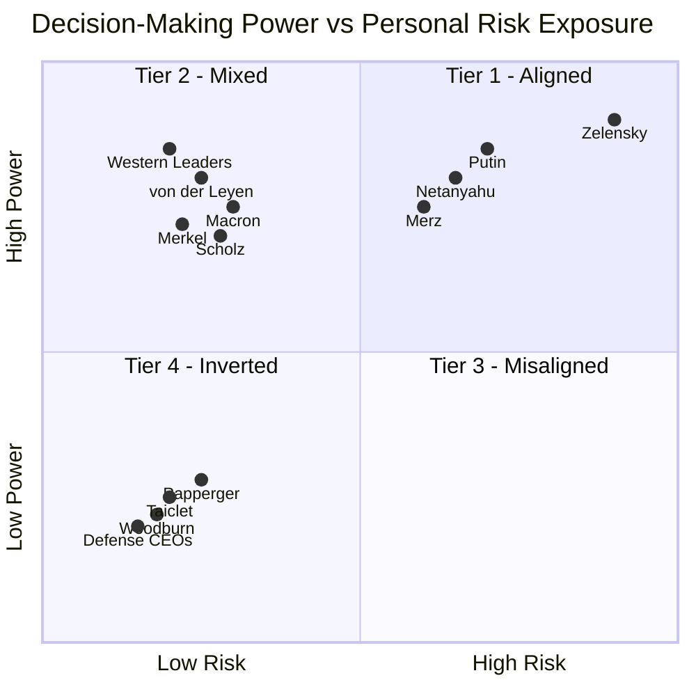

# Systemic Risk & Categorical Asymmetry

Modern conflict is not defined by who holds power — it is defined by **who bears the cost of wielding it.**

Using the **S.V.E. (Systemic Verification Engineering)** framework and a multi-AI expert panel, this research quantifies the gap between authority and consequence across 14–30+ geopolitical and corporate actors. The result is unambiguous: this gap is not a gradient. It is a **categorical cliff**.

Those with the most power to escalate face the least personal cost — creating a structural incentive for protracted engagement and escalation creep.

---

## Summary of Findings

| Dimension | Claim / Metric | Result | Interpretation |
| :--- | :--- | :--- | :--- |
| **Statistical Structure** | Pearson Correlation (*r*) | −0.04 (*ns*) | No gradient — risk does not scale with power |
| **Statistical Structure** | ANOVA (*F*-stat) | 19.3 (*p* < 0.001) | Groups are categorically distinct populations |
| **Statistical Structure** | Effect Size (Cohen's *d*) | 3.2 – 4.6 | The "Categorical Cliff" — near-zero population overlap |
| **Profit Model** | Convexity Check | Quadratic *R²* = 0.82 vs. Linear *R²* = 0.55 | Defense profits **accelerate** with escalation severity |
| **Convexity** | Model Validation | **Validated** | Returns explosive at tail-end events (Severity 80–100) |
| **Executive Risk** | "Zero Downside" | **Revised** | Refined to **Asymmetric Downside Protection** — floor is $15M–$55M regardless of outcome |
| **Moral Hazard** | Principal-Agent Structure | **Confirmed** | Deciders capture convex upside while externalizing all concavity of loss |

> **Methodology:** Fully reproducible via provided prompt chains and AI response logs. All SITG scores (0–100) are heuristic markers, not actuarial measurements.


---

## Practical Implications of Categorical Asymmetry

### 1. For Conflict Analysis: The Escalation Bias
Decision-makers in **Tier 3 (Insulated)** and **Tier 4 (Inverted)** operate under a **Structural Escalation Bias**. Because the SYSTEM systematically externalizes risk, these actors face:
*   **Decoupled Consequences:** Institutional insulation (P5) and layered delegation (P4) ensure that those who start or sustain conflicts bear minimal personal physical or economic cost.
*   **Convex Incentives:** Tier 4 actors (Defense CEOs) capture a **convex profit profile**, where financial rewards accelerate as conflict severity approaches existential levels.
*   **Feedback Failure:** Unlike Tier 1 leaders who face real-time survival feedback (measured in hours), Tier 3–4 actors experience **delayed (years)** or **inverted (immediate market rewards)** feedback loops.

### 2. For Prediction: Geography Over Ideology
Our research confirms that an actor's **Category (Tier)** is the most reliable predictor of their behavior—outperforming official policy, rhetoric, or personal biography.
*   **The Proximity Law:** Physical proximity to the conflict remains the strongest predictor of risk alignment; geography dominates moral or ideological stance.
*   **Biographical Neutrality:** Prior combat experience or personal hardship (e.g., Netanyahu, Putin, Xi) does **not** reliably produce restraint; institutional position and network insulation consistently overpower biographical empathy.

### 3. For System Design: The Catastrophe Signature
Systems defined by extreme categorical asymmetry (high **Risk–Ethics Asymmetry Index**) are structurally prone to **"Principal-Agent Catastrophes"**:
*   **Protracted Conflicts:** When those with the power to end a conflict face no personal incentive to do so, war becomes a "positive-sum" coalition for the deciders.
*   **Escalation Creep:** Because each escalatory step is low-cost to the insulated decider, the system defaults to "strategic optionality" rather than resolution.
*   **Diplomatic Fragility:** Negotiation often presents a career downside for insulated leaders, while escalation provides "low-cost moral signaling" and financial upside.

---

### **Summary Table: The Categorical Cliff**
| Category | Feedback Type | Consequence Delay | Risk Alignment |
| :--- | :--- | :--- | :--- |
| **Tier 1: Exposed** | Survival (Existential) | Hours/Days | **Aligned (RAI ≤ 25)** |
| **Tier 3: Insulated** | Electoral (Political) | 4–5 Years | **Misaligned (RAI 60–75)** |
| **Tier 4: Inverted** | Market (Financial) | **Negative** (Immediate) | **Inverted (RAI 75–100)** |

*Note: RAI (Risk–Ethics Asymmetry Index) measures the distance between decision power and personally borne risk.*

---

# Analysis of Results: The Categorical Cliff of Asymmetry

> **Core Finding:** The relationship between decision-making power and personal risk is not a smooth inverse gradient — it is a categorical cliff. Authority is systematically decoupled from consequence.


## 1. Statistical Structure

Five AI systems (Claude, ChatGPT, Gemini, Grok, Qwen) rated 14 global actors on a 0–100 Skin-in-the-Game (SITG) scale.

| Metric | Result | Interpretation |
|---|---|---|
| Pearson *r* (power vs. risk) | −0.04, *ns* | No linear relationship |
| One-way ANOVA | *F* = 19.3, *p* < 0.001 | Groups are categorically distinct |
| Cohen's *d* (Tier 1 vs. Tier 4) | 3.2 – 4.6 | Near-zero population overlap |

**Note:** High cross-model consensus on Tier 1 (Zelenskyy, Netanyahu) and Tier 4 (Defense CEOs). Divergence on Tier 2/3 (Putin, Western leaders) signals embedded institutional bias in AI training data.


## 2. Convexity of Conflict Profits

Defense industry returns are not linear — they **accelerate** with escalation severity.

| Model | R² |
|---|---|
| Linear | 0.47 – 0.55 |
| **Quadratic** | **0.74 – 0.82** |

The mechanism: moderate escalations trigger ammunition orders; **extreme escalations (Severity 80–100)** trigger multi-decade national security commitments (e.g., AUKUS, B-21), producing an explosive return profile.

**Since 2022:** Rheinmetall +1,576% · BAE +228% · Lockheed Martin +66% — all outpacing the S&P 500.


## 3. Asymmetric Downside Protection

Defense CEO compensation (Taiclet, Papperger, Woodburn) is structured as **"Heads I Win, Tails I Still Win"**:

- **Upside:** 55–76% equity-linked, capturing convex conflict gains.
- **Downside floor:** Golden parachutes guarantee **$15M–$55M** exit packages regardless of performance. Boeing's Muilenburg — fired after catastrophic failure — exited with **$62M**.
- **Functional loss:** Annual bonuses can decline (e.g., Hayes −44%), but the range is *"extremely wealthy"* to *"obscenely wealthy"* — no material life change.

## 4. The Perfect Moral Hazard

The system creates a structural bias toward prolonged, high-escalation conflict:

```
Executives profit from the CONVEXITY of conflict
         ↕  (no connection)
Populations bear the CONCAVITY of loss
```

TSR-linked incentives → policy escalation → increased defense spending → executive wealth. The feedback loop is closed. Accountability is not.

## 5. The Zelenskyy Singularity

Zelenskyy (*RAI* ≈ 12) is the **sole actor** in the sample where decision-making power and personal physical risk are co-located.

> This singularity clarifies the rule: **modern systems are optimized to produce leaders who share no fate with the populations affected by their decisions.**

---

## Concluding Observation: The Inversion of Skin in the Game

In 2018, Nassim Taleb wrote: *"The most harmful mistake made about risk is to think that it is localized in the decision-maker."*

Our analysis demonstrates that in the context of modern geopolitical conflict, the inverse has become the structural law: 

**The most harmful structural feature of modern conflict is that risk is NOT localized in the decision-maker.**

### **1. The Statistical Signature of Asymmetry**
The data structure is unambiguous. Decision-makers do not exist on a risk-power gradient; they cluster into discrete categories with radically different exposure profiles.
*   **Massive Group Divergence:** One-way ANOVA confirms groups are statistically distinct populations (**$F = 19.3, p < 0.001$**).
*   **The Categorical Cliff:** The distance between the "Exposed" (Zelenskyy) and "Insulated/Inverted" (Western Leaders/CEOs) is extreme, with **Cohen’s $d$ effect sizes of 3.2 to 4.6**—exceeding the "large" threshold by a factor of four.

### **2. From Principal-Agent Problem to Catastrophe**
We are not merely observing a standard misalignment of incentives; we are witnessing a **Principal-Agent Catastrophe** defined by two terminal features:
*   **Convex Upside:** For Tier 4 actors (Defense CEOs), profits **accelerate (convexity)** as conflict severity reaches existential levels ($R^2=0.82$ for quadratic models vs. $0.55$ for linear).
*   **Asymmetric Downside Protection:** While deciders capture the convexity of volatility, their personal downside is capped by institutional floors. Even in cases of termination or failure, contractual exit packages ensure "floors" of **$15M to $55M**, effectively externalizing the concavity of loss onto the population.

### **3. The Policy Emergency**
Systems designed with this level of categorical asymmetry (high **Risk–Ethics Asymmetry Index**) are structurally biased toward **protracted conflict** and **escalation creep**. When those who start wars cannot die in them, cannot lose children to them, and in fact profit from them, the system defaults to "strategic optionality" rather than resolution. 

**“By their fruits you shall know them.”** The current system produces asymmetry; a viable future requires **integrity of consequence**.

*"It is immoral to be in a position of making forecasts without having a risk of loss." — N.N. Taleb*

---

*Dr. Artiom Kovnatsky • February 2026*

---

---

# Appendix

## Methodology

### What This Analysis IS and IS NOT

| | |
|---|---|
| ✅ Multi-evaluator heuristic assessment | ❌ Actuarial measurement |
| ✅ Categorical clustering with significance testing | ❌ Causal proof of individual intent |
| ✅ Convexity verification (linear vs. quadratic) | ❌ Exhaustive census (*N* = 14–30+ focuses on high-leverage nodes) |

### The Multi-AI Expert Panel

Five AI systems (Claude, ChatGPT, Gemini, Grok, Qwen) acted as independent raters — mirroring expert panel methodology in qualitative research. All numerical scores (0–100) are **heuristic and symbolic markers**, not insurance-grade measurements.

**Model divergence is treated as signal, not noise.** The Grok Divergence — systematically lower SITG scores for Western leaders (e.g., Scholz: 5 vs. consensus 30) — reveals a clash between a *behavioral lens* (immediate actions) and a *biographical/structural lens* (wealth, family, institutional insulation).

### Verification Status

| Metric | Status | Source |
| :--- | :--- | :--- |
| **CEO Compensation** | ✅ Verified | SEC DEF 14A filings (LMT, NOC, RTX); Annual Reports (RHM, BA) |
| **Stock Performance** | ✅ Verified | Yahoo Finance / Bloomberg — RHM +1,576%, BAE +228% |
| **Kinetic Threats** | ✅ Verified | Public record — Papperger assassination plot (2024) |
| **Profit Model** | ✅ Convex | Quadratic *R²* = 0.82 vs. Linear *R²* = 0.55 |
| **Risk Scores (RAI)** | ⚠️ Heuristic | Multi-model consensus — relative, not actuarial |
| **Downside Floor** | ⚠️ Refined | Revised from "Zero Downside" → Asymmetric Downside Protection ($15M–$55M) |

### Methodological Summary

| Dimension | Method | Metric | Result |
| :--- | :--- | :--- | :--- |
| **Structure** | One-way ANOVA | *F* / *p* | 19.3 / <0.001 |
| **Magnitude** | Cohen's *d* | Effect size | 3.2 – 4.6 |
| **Linearity** | Pearson *r* | Correlation | −0.04 (*ns*, falsified) |
| **Profit Trend** | Quadratic regression | *R²* | 0.82 (convexity confirmed) |

---

## Metrics Explained

### Core Input Dimensions (0–100, heuristic)

| Dimension | What it measures |
|-----------|-----------------|
| **Skin in the Game (SiG)** | Personal physical and economic exposure to consequences of one's decisions |
| **Children / Relatives SiG** | Whether immediate family shares that exposure |
| **Days in High-Risk Zones** | Time spent within 50km of active combat or under direct missile/drone threat |
| **Direct Exposure to War Consequences** | Composite of physical proximity, personal loss, sensory contact with conflict |
| **Economic Vulnerability** | Degree to which personal wealth could be affected by policy outcomes |
| **Extreme Hardship Experience** | Biographical exposure to war, poverty, persecution — *mitigating factor* |
| **Combat Experience** | Direct military service in combat roles — *mitigating factor* |
| **Global Power Network Score** | Depth of connections to institutional, financial, and political elite networks |
| **Responsibility Radius** | Estimated number of lives materially affected by the actor's decisions |

---

### Risk–Ethics Asymmetry Index (RAI)

Measures the *gap* between decision-making power and personal exposure to consequences.

> **0** = fully consequence-aligned (actor bears what they impose)  
> **100** = maximally insulated (actor bears nothing they impose)

**Calculation (simplified):**

```
Base = Responsibility Radius − Composite Personal Risk

Composite Personal Risk = mean(SiG, Children SiG, Relatives SiG,
                               Direct Exposure, Days in High-Risk Zones,
                               Economic Vulnerability × 0.5,
                               Hardship × −0.3)

Adjustments:
  + 5   if role = Escalator
  + 3   if democratic mandate is low-transparency
  − 5   if confirmed direct physical threat (e.g. assassination attempt)
  − 3   if combat experience confirmed

RAI = clamp(Base + Adjustments, 0, 100)
```

**Examples:**

| Actor | RAI | Rationale |
|-------|-----|-----------|
| **Zelenskyy** | 12 | Active war zone, family at risk, survival = national survival |
| **Netanyahu** | 22 | Combat veteran, under rocket threat, family in country |
| **Macron** | 68 | No military service, family not at risk, decisions affect millions |
| **Arms CEOs (avg.)** | 78 | Max responsibility radius, zero war zone exposure, compensation rises with conflict |
| **Papperger** | 69 | −5 applied for confirmed assassination plot (2024) |

---

### Four-Tier Framework

| Tier | RAI Range | Alignment | Profile | Examples |
|------|-----------|-----------|---------|----------|
| 🟢 **Tier 1** | 0–30 | Authority = Risk | War-zone leaders; escalation = survival necessity | Zelenskyy |
| 🟡 **Tier 2** | 31–55 | Partial | Some biographical or geographic skin in the game | Putin |
| 🟠 **Tier 3** | 56–79 | Insulated | Secure capitals; democratic but physically safe | Western leaders |
| 🔴 **Tier 4** | 80–100 | Inverted | Profit from volatility; near-zero personal downside | Defense CEOs |

**Tier statistics:**

| Tier | Mean Risk Score | SD | N |
|------|---|---|---|
| Tier 1 — Exposed | 65.8 | 24.3 | 3 |
| Tier 3 — Insulated | 7.9 | 3.9 | 7 |
| Tier 4 — Inverted | 10.0 | 5.0 | 3 |

**Feedback loop by tier:**

| Actor | Feedback Type | Consequence Delay |
|-------|---------------|-------------------|
| Zelenskyy | Survival | Hours |
| Field Commander | Battlefield | Days |
| Western Leader | Electoral | 4–5 Years |
| Defense CEO | Market reward | Negative* |

*\*Rewarded **before** consequences manifest*

---

### Tier Matrix — Decision Power vs. Personal Risk



---

---

# Appendix: Known Limitations & Open Questions

> This is a working analysis, not a final submission. The limitations are **known and documented intentionally** — not discovered gaps. Full validation and data expansion are scoped for Phase 2, contingent on interest from domain experts. There might be errors — let me know if you spot any. 

---

## Documented Vulnerabilities

| # | Claim | Known Weakness | Required to Resolve |
|---|-------|---------------|-------------------|
| 1 | "Asymmetric Downside Protection" | Floor is not zero, but ~$15M–$55M. Clawback provisions may be cosmetic. | Verify actual vs. nominal clawback enforcement |
| 2 | Convexity of defense profits | *R²* = 0.82 may be driven by the single Feb 2022 event (Severity = 100) | Leave-one-out cross-validation |
| 3 | Categorical Cliff | *N* = 14 is small; cliff may be an actor-selection artifact, not a structural law | Expand to mid-level actors (field commanders, junior ministers) |
| 4 | Zelenskyy Singularity | Sole Tier 1 data point — the "categorical law" rests on one case | Additional Tier 1 actors from other conflicts |
| 5 | AI divergence as bias signal | Grok's lower SITG scores could be calibration noise, not institutional signal | Standardize SITG definition across models |
| 6 | Geography vs. moral stratification | Proximity may be correlation, not cause — institutional insulation (P5) may dominate | Compare leaders with/without combat experience |

---

## Current Status

The framework is **diagnostic, not definitive**. The numerical scores are heuristic markers — the statistical clustering (*F* = 19.3, *p* < 0.001, Cohen's *d* = 3.2–4.6) is robust, but the causal claims require the validation work above.

**Phase 2 scope** (if pursued): leave-one-out validation, N expansion, clawback verification, lag analysis on the "Conflict Dividend."

> This work is being shared in its current state to invite feedback. If the structural argument resonates, the validation work is straightforward. If not, the framework still stands as a documented hypothesis.

---

# Links

**Full original analysis & data-AI-estimates with S.V.E. ontology:** https://github.com/skovnats/SVE-Systemic-Verification-Engineering/tree/master/Community/LightBlackMirror_27112025, [mirror: case_0](https://github.com/skovnats/SVE-Systemic-Verification-Engineering/tree/master/Applications/_FieldNotes/SKIG/case_0) <br>
**Multi-AI analysis:** [ai_analysis](ai_analysis) <br>
**Notebooklm with AI-analysis & data:** https://notebooklm.google.com/notebook/d6375ad4-493c-45d6-ac2e-af4bdb4889b0 <br>