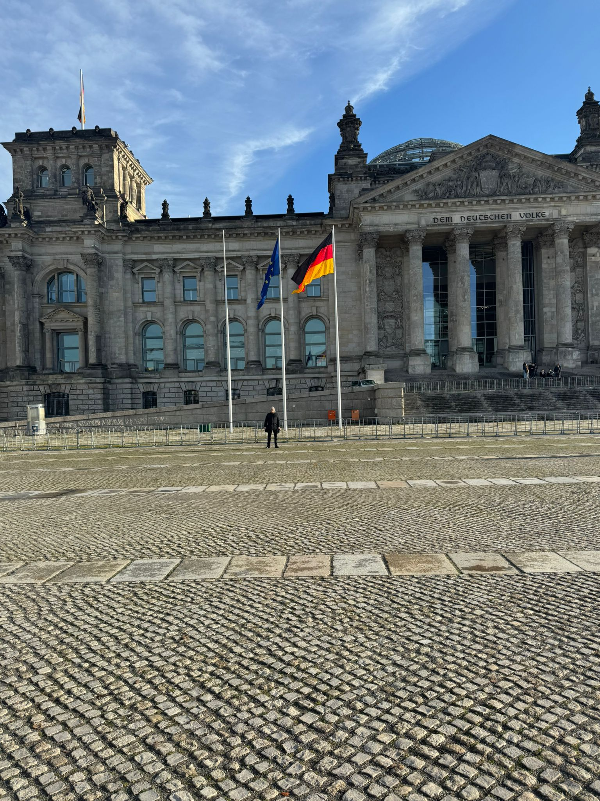
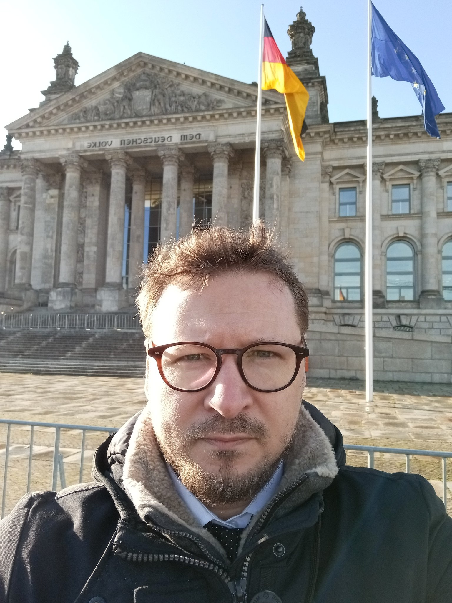
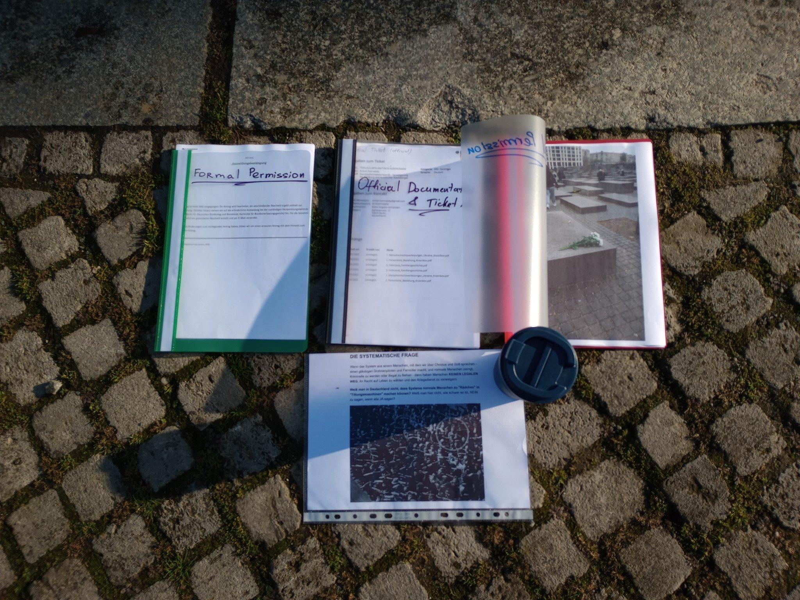
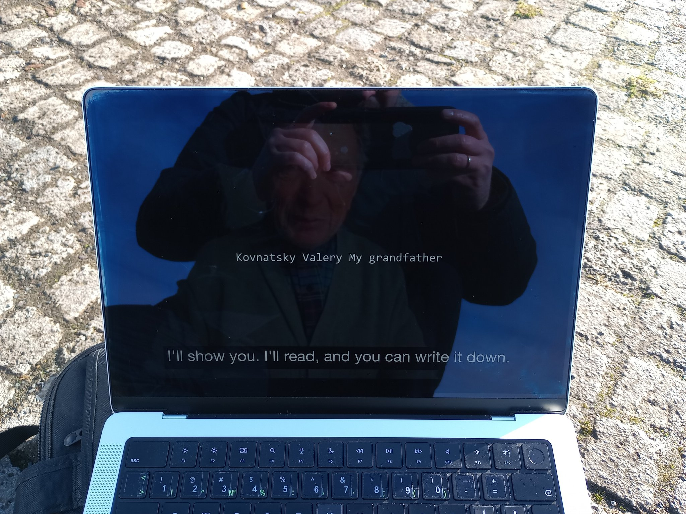

### [Mirror 1](https://gitlab.com/opa-collective/sve/-/tree/master/Community/19112025_Berlin_Bundestag_SoloPerformance?ref_type=heads)   [Mirror 2](https://mega.nz/#P!AgCnnGXFntkv6BR0GL5bcAuiHajFyhUFNwH011cHYHEZbq9rRHzuWatzwbeN5eYvp5fo7kWtBv4h5xuiEXDJK4xXJfR3tunQqaKn74Ua0ncbmLFYTPkAoA)

# [REPORTS.md](reports/REPORTS.md)
# [QUESTIONS.md](https://github.com/skovnats/SVE-Systemic-Verification-Engineering/blob/master/Community/19112025_Berlin_Bundestag_SoloPerformance/QUESTIONS.md)

# 19.11.2025 — Bundestag, 11:00 CET

## 📍 Bundestag, Berlin — 19.11.2025, 11:00 

[X post](https://x.com/ArtiomKovnatsky/status/1991107595487138155?s=20)

Today, with God’s help, I will stand alone — quietly and peacefully —
for one simple principle: every human life has the right to choose safety.

## ⚖️ 3 Questions (44+ days unanswered):

Why is there no legal exit for all non-combatant civilians in Ukraine?

Why freedom for women, but prison for men?

Why do taxpayers finance these violations?

## 🎥 Video testimonies (shown at the Bundestag):
👉 https://youtu.be/HybMU2IiIKo

**SPEECH (Short Home Version)**:
https://youtu.be/3JH7zYVaLjE

**SOLO PERFORMANCE (Bundestag, Berlin — 19.11.2025)**:
https://youtu.be/VQorY9-k5Ro

## 🆘 THE AK1984-LIST
If you — or your relatives/friends — do not want to die in the war
and may wish to leave Ukraine legally and safely, fill in the form:
👉 https://www.artiomkovnatsky.com/the-ak1984-list

I add every entry to the documentation already opened with the German MFA
and send weekly updates to MFA, media and human-rights organizations.
Public report: every Sunday/Monday on my X account.

## 📂 Full materials (speech, docs, translations, performance):
👉 http://tiny.cc/l39v001

## GitHub archive:
https://github.com/skovnats/SVE-Systemic-Verification-Engineering/tree/master/Community/19112025_Berlin_Bundestag_SoloPerformance

### ✋ I give no interviews.
Please watch, read, and decide for yourself.

#### Found errors? Please report, I will fix. | Нашли ошибку? Сообщите, я исправлю.

#HumanRights #Bundestag #Ukraine #Peace #NeverAgain

 
 
 

