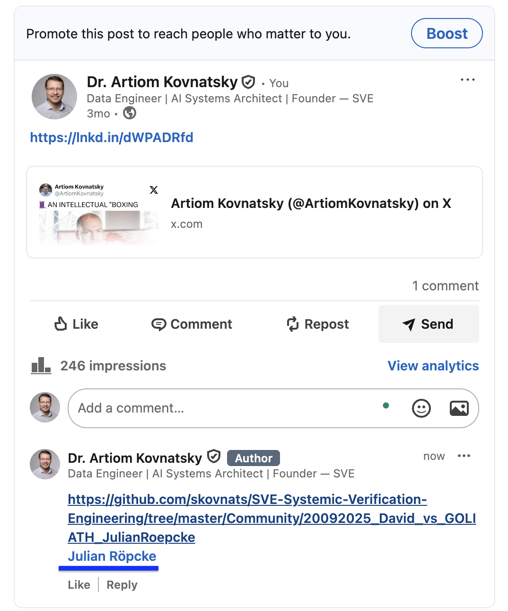

# **David vs GOLIATH — Scientific Refutation Request (S.V.E.–SIP)**

**Date start:** 20.09.2025 20:20\
**Date finish:** 03.10.2025 20:21\
**Target:** [Julian Röpcke (BILD)](https://www.bild.de/autor/julian-roepcke) [X.com](https://x.com/JulianRoepcke) [YouTube example](https://www.youtube.com/watch?v=SkZ76yxZg4c) ["Truth and Justice are not only words." (c) Julian Röpcke @linkedin.com](https://www.linkedin.com/in/julian-r%C3%B6pcke-20a990a8/)  
**Method:** S.V.E., SIP / Meta-SIP structural verification

This folder documents the [public 44-day verification challenge issued to Julian Röpcke (BILD)](post_challange.pdf).
The challenge required refuting the S.V.E.–SIP analytical pipeline using the *same* scientific method.

### **Outcome:** [No reply. Deadline passed.](post_conclusion.pdf) Julian Röpcke (BILD) is welcome to accept the challenge anytime. 

### **Included**

* **SIP symbolic probability table**
  → `symbolic_probabilities_nato_urkaine_russia.png`
* PDF of the full challenge post & related S.V.E. papers.

This folder records the invitation to a transparent, method-based dialogue that was not accepted.

### Links:
https://x.com/ArtiomKovnatsky/status/1969466669920583786?s=20  
https://x.com/ArtiomKovnatsky/status/1985427061507568002?s=20  
https://zenodo.org/records/18108307  
https://zenodo.org/records/18108751

