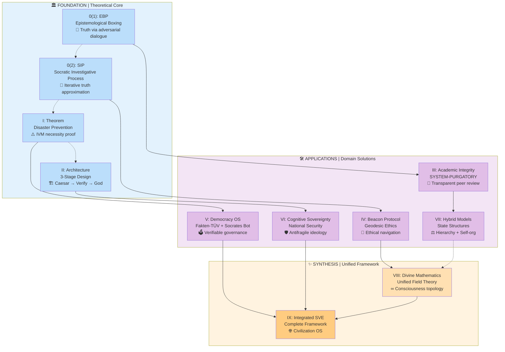

## Quick Navigation Guide

### 🎯 Where to Start?

**For Researchers:**
- Start: `SIP (0.2)` → `Theorem (I)` → Choose application domain
- Goal: Understanding methodology and theoretical foundation

**For Practitioners:**
- Start: `Architecture (II)` → `Democracy OS (V)` → Tools
- Goal: Implementing S.V.E. in real institutions

**For Philosophers:**
- Start: `EBP (0.1)` → `Beacon Protocol (IV)` → `Divine Math (VIII)`
- Goal: Understanding epistemological and ethical foundations

**For Developers:**
- Start: `SIP (0.2)` → Tools/socrates-bot → Applications
- Goal: Building verification systems

### 🔄 Reading Paths

#### Path 1: Minimal (Core Understanding)
```
SIP (0.2) → Theorem (I) → Architecture (II) → Democracy OS (V)
```
**Time:** 4-6 hours  
**Outcome:** Operational understanding

#### Path 2: Complete (Deep Mastery)
```
EBP (0.1) → SIP (0.2) → Theorem (I) → Architecture (II) →
Academic (III) → Beacon (IV) → Democracy (V) → Security (VI) →
Hybrid Models (VII) → Divine Math (VIII) → Integration (IX)
```
**Time:** 20-30 hours  
**Outcome:** Full framework comprehension

#### Path 3: Applied (Implementation)
```
Architecture (II) → Democracy OS (V) → Tools → Applications
```
**Time:** 3-4 hours  
**Outcome:** Ready to pilot S.V.E. protocols

### 📋 Paper Dependencies

| Paper | Prerequisites | Unlocks |
|-------|--------------|---------|
| **0(1): EBP** | None | Understanding of truth synthesis |
| **0(2): SIP** | None | Core methodology |
| **I: Theorem** | Basic probability | Why IVM is necessary |
| **II: Architecture** | SIP, Theorem | Institutional design |
| **III-VI: Applications** | Architecture | Domain implementations |
| **VII: Hybrid Models** | Architecture, Applications | Governance synthesis |
| **VIII: Divine Math** | Beacon Protocol preferred | Metaphysical foundation |
| **IX: Integration** | All above | Complete picture |

### 🎓 Depth Levels

```
┌─────────────────────────────────────────┐
│ Level 1: USER                           │
│ → Uses Socrates Bot                     │
│ → Understands 3-stage architecture      │
│ → Time: 1 hour                          │
├─────────────────────────────────────────┤
│ Level 2: IMPLEMENTER                    │
│ → Reads SIP, Architecture, Democracy OS │
│ → Can pilot Fakten-TÜV                  │
│ → Time: 5-8 hours                       │
├─────────────────────────────────────────┤
│ Level 3: RESEARCHER                     │
│ → Reads Foundation + Applications       │
│ → Can extend framework                  │
│ → Time: 15-20 hours                     │
├─────────────────────────────────────────┤
│ Level 4: ARCHITECT                      │
│ → Reads entire corpus                   │
│ → Understands Divine Mathematics        │
│ → Can design new applications           │
│ → Time: 25-35 hours                     │
└─────────────────────────────────────────┘
```

### 🔑 Key Concepts by Paper

| Paper | Core Innovation | One-Sentence Takeaway |
|-------|----------------|----------------------|
| **EBP** | Structured adversarial dialogue | "Philosophy becomes executable protocol" |
| **SIP** | Iterative vector purification | "Truth is computationally approximated" |
| **Theorem** | Mathematical IVM proof | "Collective intelligence needs verification or fails" |
| **Architecture** | 3-stage separation | "Facts (Caesar) ≠ Values (God)" |
| **Academic** | SYSTEM-PURGATORY | "Peer review as boxing match" |
| **Beacon** | Geodesic ethics | "Ethics is geometry in meaning-space" |
| **Democracy** | Fakten-TÜV | "Institutional verification architecture" |
| **Security** | Cognitive sovereignty | "Protect collective intelligence from warfare" |
| **Hybrid Models** | Hierarchy + Anthill | "Governance needs both structure and emergence" |
| **Divine Math** | Unified field theory | "Consciousness, ethics, economics as manifold" |
| **Integration** | Complete framework | "Operating system for civilization" |