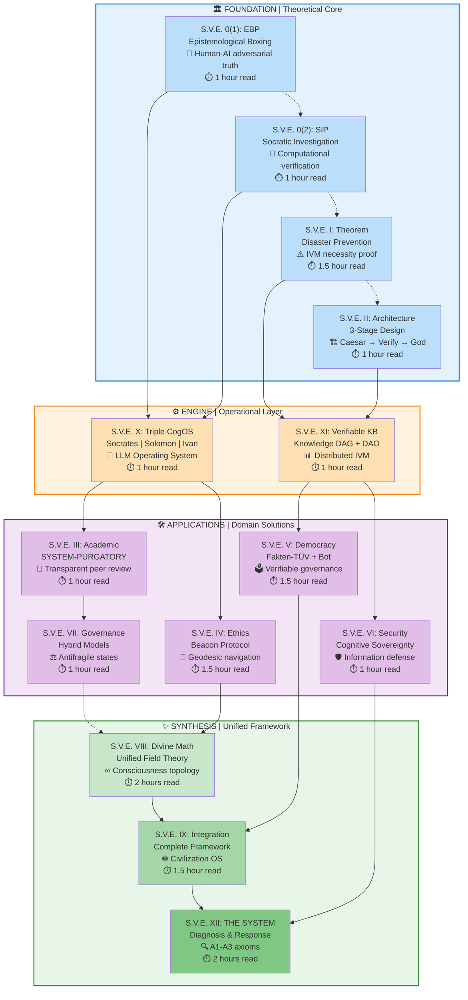

# S.V.E. Universe — Interactive Navigation
**Your guide to the S.V.E. framework**

---

## 🗺️ Visual Framework Map



---

## 🎯 Where Should You Start?

### Quick Decision Tree

```
What's your goal?
├─ USE S.V.E. in my work
│  └─ Start: Architecture (II) → Democracy OS (V) → Tools
│     Time: 2-3 hours
│     Outcome: Operational capability
│
├─ UNDERSTAND S.V.E. deeply
│  └─ Start: SIP (0.2) → Theorem (I) → Choose domain
│     Time: 10-15 hours
│     Outcome: Research capability
│
├─ CRITIQUE S.V.E. philosophically
│  └─ Start: EBP (0.1) → Beacon (IV) → Divine Math (VIII)
│     Time: 6-8 hours
│     Outcome: Philosophical engagement
│
├─ IMPLEMENT S.V.E. institutionally
│  └─ Start: Architecture (II) → Democracy OS (V) → Contact
│     Time: 1-6 months
│     Outcome: Organizational transformation
│
└─ EXPLORE S.V.E. interactively
   └─ Start: Socrates Bot v0.2
      Time: 15 minutes
      Link: https://chatgpt.com/g/g-68f1fc9848948191a1cc038db8e3422b-sokrat-socrates-bot-v0-2
```

---

## 📚 Reading Paths

### Path 1: Minimal (Core Understanding)

**Time:** 4-5 hours  
**Goal:** Operational understanding of S.V.E.

```
Step 1: SVE-0-2-SIP.pdf (1 hour)
        ↓
        Learn computational truth method
        Key concept: Iterative Facts

Step 2: SVE-I-Theorem.pdf (1.5 hours)
        ↓
        Understand why IVM is necessary
        Key concept: Collective intelligence fails without verification

Step 3: SVE-II-Architecture.pdf (1 hour)
        ↓
        See institutional design pattern
        Key concept: Caesar (facts) ≠ God (values)

Step 4: SVE-V-Democracy-OS.pdf (1.5 hours)
        ↓
        Connect theory to practice
        Key concept: Fakten-TÜV implementation

✅ Outcome: You can apply S.V.E. protocols
```

---

### Path 2: Complete (Deep Mastery)

**Time:** 20-30 hours  
**Goal:** Full framework comprehension

```
FOUNDATION LAYER (6 hours)
├─ SVE-0-1-EBP.pdf (1 hour) — Method
├─ SVE-0-2-SIP.pdf (1 hour) — Computation
├─ SVE-I-Theorem.pdf (1.5 hours) — Proof
├─ SVE-II-Architecture.pdf (1 hour) — Design
└─ SVE-XII-THE-SYSTEM.pdf (2 hours) — Diagnosis

ENGINE LAYER (2 hours)
├─ SVE-X-CogOS.pdf (1 hour) — LLM OS
└─ SVE-XI-VKB.pdf (1 hour) — Knowledge infrastructure

APPLICATION LAYER (7 hours)
├─ SVE-III-Academic.pdf (1 hour) — Science
├─ SVE-IV-Beacon.pdf (1.5 hours) — Ethics
├─ SVE-V-Democracy-OS.pdf (1.5 hours) — Governance
├─ SVE-VI-Security.pdf (1 hour) — Defense
└─ SVE-VII-Governance.pdf (1 hour) — States

SYNTHESIS LAYER (4-6 hours)
├─ SVE-VIII-Divine-Math.pdf (2 hours) — Metaphysics
└─ SVE-IX-Integration.pdf (1.5 hours) — Complete OS

✅ Outcome: You can extend S.V.E., design new applications
```

---

### Path 3: Applied (Implementation)

**Time:** 3-4 hours reading + 1-6 months implementation  
**Goal:** Ready to pilot S.V.E. protocols

```
Week 1: Education
├─ SVE-II-Architecture.pdf (1 hour)
├─ SVE-V-Democracy-OS.pdf (1.5 hours)
└─ Explore Socrates Bot (30 min)

Week 2: Planning
├─ Map to your context (2 hours)
├─ Choose application (1 hour)
└─ Draft protocol (3 hours)

Week 3-4: Pilot Design
├─ Define metrics (2 hours)
├─ Train team (8 hours)
└─ Setup infrastructure (10 hours)

Month 2-3: Implementation
├─ Run first cases (ongoing)
├─ Track KPIs daily
└─ Iterate based on feedback

Month 4-6: Scale
├─ Expand to organization
└─ Integrate with systems

✅ Outcome: Operational S.V.E. in your institution
```

---

## 📋 Paper Dependencies & Prerequisites

### Foundation Papers (Start Here)

| Paper | Prerequisites | Unlocks | Key Insight |
|-------|--------------|---------|-------------|
| **0(1): EBP** | None | Understanding of truth synthesis | Philosophy → Protocol |
| **0(2): SIP** | None | Core methodology | Truth is computational |
| **I: Theorem** | Basic probability | Why IVM is necessary | Collective intelligence needs verification |
| **II: Architecture** | SIP, Theorem | Institutional design | Facts ≠ Values |

### Engine Papers (Technical)

| Paper | Prerequisites | Unlocks | Key Insight |
|-------|--------------|---------|-------------|
| **X: CogOS** | EBP, SIP | LLM operating system | AI needs ethical architecture |
| **XI: VKB** | Theorem, Architecture | Distributed IVM | Knowledge as verifiable DAG |

### Application Papers (Domain-Specific)

| Paper | Prerequisites | Unlocks | Key Insight |
|-------|--------------|---------|-------------|
| **III: Academic** | Architecture | SYSTEM-PURGATORY | Peer review as boxing |
| **IV: Beacon** | SIP, (Divine Math preferred) | Ethical navigation | Ethics is geometry |
| **V: Democracy OS** | Architecture, Theorem | Fakten-TÜV | Institutional verification |
| **VI: Security** | Architecture, Theorem | Cognitive sovereignty | Protect collective intelligence |
| **VII: Governance** | Architecture, Applications | Hybrid models | Structure + emergence |

### Synthesis Papers (Advanced)

| Paper | Prerequisites | Unlocks | Key Insight |
|-------|--------------|---------|-------------|
| **VIII: Divine Math** | Beacon Protocol | Metaphysical foundation | Reality as manifold |
| **IX: Integration** | All above | Complete picture | Civilization OS |
| **XII: THE SYSTEM** | All Foundation + Engine | Systemic diagnosis | A1-A3 axioms model collapse |

---

## 🎓 Depth Levels

### Level 1: USER (1 hour)

```
You can:
├─ Use Socrates Bot
├─ Understand 3-stage architecture
├─ Explain S.V.E. to others
└─ Identify when S.V.E. applies

Reading: Architecture (II)
Time: 1 hour
```

### Level 2: IMPLEMENTER (5-8 hours)

```
You can:
├─ Run SIP on claims
├─ Design 3-stage protocols
├─ Pilot Fakten-TÜV
└─ Train others

Reading: SIP, Architecture, Democracy OS
Time: 5-8 hours
```

### Level 3: RESEARCHER (15-20 hours)

```
You can:
├─ Validate S.V.E. empirically
├─ Extend framework to new domains
├─ Design new applications
└─ Publish S.V.E. research

Reading: Foundation + Applications
Time: 15-20 hours
```

### Level 4: ARCHITECT (25-35 hours)

```
You can:
├─ Design institutional S.V.E. implementations
├─ Understand Divine Mathematics
├─ Create new S.V.E. tools
├─ Train Level 1-3 users
└─ Contribute to S.V.E. core

Reading: Entire corpus
Time: 25-35 hours
```

---

## 🔑 Key Concepts by Paper

### Quick Reference Table

| Paper | Core Innovation | One-Sentence Takeaway | Primary Use |
|-------|----------------|----------------------|-------------|
| **EBP** | Structured adversarial dialogue | Philosophy becomes executable protocol | Pre-publication verification |
| **SIP** | Iterative vector purification | Truth is computationally approximated | Fact-checking claims |
| **Theorem** | Mathematical IVM proof | Collective intelligence needs verification or fails | Justification for S.V.E. |
| **Architecture** | 3-stage separation | Facts (Caesar) ≠ Values (God) | Institutional design |
| **CogOS** | Triple architect LLM OS | AI needs Socrates + Solomon + Ivan | LLM alignment |
| **VKB** | Knowledge DAG + DAO | Wikipedia 2.0 with verification | Knowledge infrastructure |
| **Academic** | SYSTEM-PURGATORY | Peer review as boxing match | Journal transformation |
| **Beacon** | Geodesic ethics | Ethics is geometry in meaning-space | Moral navigation |
| **Democracy** | Fakten-TÜV | Institutional verification architecture | Government fact-checking |
| **Security** | Cognitive sovereignty | Protect collective intelligence from warfare | National security |
| **Hybrid Models** | Hierarchy + Anthill | Governance needs both structure and emergence | State design |
| **Divine Math** | Unified field theory | Consciousness, ethics, economics as manifold | Metaphysical foundation |
| **Integration** | Complete framework | Operating system for civilization | Holistic implementation |
| **SYSTEM** | A1-A3 diagnosis | Axioms of societal collapse + S.V.E. response | Civilizational analysis |

---

## 🛠️ Application Selection Guide

### Which S.V.E. Tool Should You Use?

| Your Situation | Recommended Paper | Tool/Protocol | Implementation Time |
|----------------|-------------------|---------------|---------------------|
| **Academic journal editor** | III (Academic) | SYSTEM-PURGATORY | 3-6 months |
| **News organization** | V (Democracy OS) | Fakten-TÜV | 2-4 months |
| **Government agency** | VI (Security) | Cognitive Sovereignty | 4-8 months |
| **Think tank researcher** | 0(2) (SIP) + V | Meta-SIP | 2-3 months |
| **AI company** | X (CogOS) + EBP | Alignment testing | Ongoing |
| **NGO/Watchdog** | 0(2) (SIP) | Socrates Bot + SIP | 1-2 weeks |
| **Educator** | Full curriculum | All papers | 1 semester |
| **Philosopher** | IV (Beacon) + VIII | Geometric ethics | Study only |
| **Policy analyst** | V (Democracy OS) | 3-stage analysis | 1-2 months |

---

## 🚦 Traffic Light System: Is S.V.E. Right for This?

### Green Light ✅ (Perfect Fit)

- Institutional integrity issues
- Fact-checking / verification needs
- Academic peer review reform
- Geopolitical analysis
- AI alignment challenges
- Democratic legitimacy crises
- Policy verification
- Scientific consensus building
- Intelligence analysis (with transparency)

### Yellow Light 🟡 (Possible with Adaptation)

- Individual decision-making
- Small team dynamics
- Education / pedagogy
- Personal ethics
- Business strategy
- Legal reasoning

### Red Light 🔴 (Not Designed For)

- Pure opinion / taste
- Artistic judgment
- Romantic relationships
- Highly personal matters
- Entertainment preferences
- Spiritual practices (non-institutional)

**Principle:** S.V.E. is designed for **INSTITUTIONAL** and **COLLECTIVE** intelligence, not all aspects of human life.

---

## 📊 Concept Dependency Graph

### How Papers Build on Each Other

```
Level 0: Foundation
    EBP ────────────┐
                    ├──> CogOS ──> Academic
    SIP ────────────┤            ├─> Ethics
                    │            └─> (All applications)
    Theorem ────────┤
                    ├──> VKB ──> Democracy
    Architecture ───┘         ├─> Security
                              └─> (All applications)

Level 1: Engine
    CogOS ──────────┐
                    ├──> Applications ──> Governance
    VKB ────────────┘

Level 2: Applications
    Academic ──┐
    Ethics ────┤
    Democracy ─┼──> Synthesis ──> Divine Math ──> Integration
    Security ──┤                                      │
    Governance ┘                                      │
                                                      ├──> THE SYSTEM
                                                      │
                                                      └──> Complete S.V.E.

Level 3: Synthesis
    Divine Math ──┐
                  ├──> Integration ──> THE SYSTEM
    (All above) ──┘
```

---

## 🎯 Goal-Oriented Navigation

### "I Want to..." Guide

| Goal | Start With | Then Read | Finally |
|------|-----------|-----------|---------|
| **Improve academic peer review** | Architecture (II) | Academic (III) | Contact for pilot |
| **Build fact-checking org** | SIP (0.2) | Democracy OS (V) | Fakten-TÜV blueprint |
| **Defend against disinformation** | Theorem (I) | Security (VI) | Cognitive Sovereignty |
| **Navigate ethical dilemmas** | Beacon (IV) | Divine Math (VIII) | Practice application |
| **Test AI alignment** | EBP (0.1) | CogOS (X) | Implement protocol |
| **Analyze geopolitics** | SIP (0.2) | SYSTEM (XII) | Meta-SIP application |
| **Design antifragile institutions** | Architecture (II) | Governance (VII) | Hybrid model |
| **Understand S.V.E. philosophy** | EBP (0.1) | Divine Math (VIII) | Integration (IX) |
| **Implement full S.V.E.** | All Foundation | All Applications | Contact for support |

---

## 🧭 Interactive Exploration

### Use Socrates Bot v0.2

**Best for:**
- Quick questions about S.V.E.
- Guided paper selection
- Concept clarification
- Application brainstorming

**Access:** [Socrates Bot v0.2](https://chatgpt.com/g/g-68f1fc9848948191a1cc038db8e3422b-sokrat-socrates-bot-v0-2)

**Sample prompts:**
```
"Explain SIP to a 12-year-old"
"How would S.V.E. apply to my academic journal?"
"Compare EBP to Popper's falsification"
"What's the difference between Caesar's and God's realms?"
"Walk me through a Fakten-TÜV analysis"
"How does Beacon Protocol work in practice?"
```

---

## 📈 Learning Curve

### Expected Proficiency Timeline

```
Hour 1: High-level understanding
├─ Read: README.md
├─ Watch: Mermaid diagrams
└─ Try: Socrates Bot

Hour 5: Operational capability
├─ Read: Architecture, Democracy OS
├─ Understand: 3-stage pattern
└─ Can: Apply to simple cases

Hour 15: Research capability
├─ Read: Foundation papers
├─ Understand: Theoretical basis
└─ Can: Validate, extend S.V.E.

Hour 30: Architect capability
├─ Read: Entire corpus
├─ Understand: Complete framework
└─ Can: Design institutional implementations

Month 3: Institutional transformation
├─ Implement: Pilot program
├─ Measure: KPIs
└─ Can: Scale to organization
```

---

## 🎓 Glossary Quick Reference

| Term | Paper | Page | Simple Definition |
|------|-------|------|-------------------|
| **EBP** | 0(1) | Throughout | Human-AI adversarial dialogue |
| **SIP** | 0(2) | Throughout | Iterative truth refinement |
| **IVM** | I | Throughout | Independent Verification Mechanism |
| **Iterative Fact** | 0(2) | p.5 | Claim surviving N challenges |
| **Caesar's Realm** | II | p.3 | Domain of facts (what IS) |
| **God's Realm** | II | p.3 | Domain of values (what OUGHT) |
| **3-Stage** | II | Throughout | Caesar → Verify → God |
| **Beacon Protocol** | IV | Throughout | Ethical navigation via geodesics |
| **Christ-Vector** | IV, VIII | p.8, p.12 | Reference direction in manifold |
| **Fakten-TÜV** | V | Throughout | Institutional fact-checking office |
| **Meta-SIP** | 0(2), XII | p.10, Throughout | Multi-agent SIP for complex systems |
| **PURGATORY** | III | Throughout | Transparent peer review protocol |
| **CogOS** | X | Throughout | Cognitive Operating System (LLM) |
| **VKB** | XI | Throughout | Verifiable Knowledge Base |
| **A1-A3** | XII | p.4-6 | Axioms of systemic failure |
| **ρ(t)** | VIII, XII | p.15, p.20 | Civilizational resilience function |
| **Sobornost'** | VIII | p.18 | Collective Will (ε component) |

---

## 📧 Get Help

### Support Resources

| Need | Resource | Response Time |
|------|----------|---------------|
| **Quick question** | Socrates Bot | Immediate |
| **Concept clarification** | GitHub Discussions | 1-3 days |
| **Bug report** | GitHub Issues | 1-5 days |
| **Implementation support** | Email artiomkovnatsky@pm.me | 1-7 days |
| **Partnership inquiry** | Email + schedule call | 1-2 weeks |

---

## 🚀 Next Steps

### Choose ONE action now:

```
☐ Read your first paper (Architecture recommended)
☐ Try Socrates Bot with your domain question
☐ Star the repository
☐ Join GitHub Discussions
☐ Contact for institutional pilot
☐ Share S.V.E. with a colleague
```

---

**Built in service of Truth and Love** ✝️

> *"Ask, and it will be given to you; seek, and you will find."* — Matthew 7:7

---

**Last Updated:** October 2024  
**Version:** v2.0 (Interactive)  
**Feedback:** Open issue or email artiomkovnatsky@pm.me