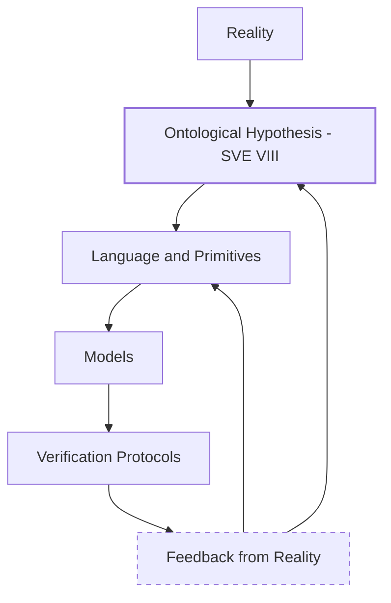

S.V.E.-VIII proposes a provisional ontological hypothesis:
that ethical and epistemic dynamics can be treated as a geometry.
This hypothesis is not asserted as truth, but adopted as a working assumption,
whose validity depends on the performance of models instantiated within it.

S.V.E.-VIII deliberately exposes its ontology.
This ontology is provisional and exists only insofar as
it produces models that survive verification.
Failure of instantiated models is treated as evidence
against the ontology and triggers revision of the language itself.

