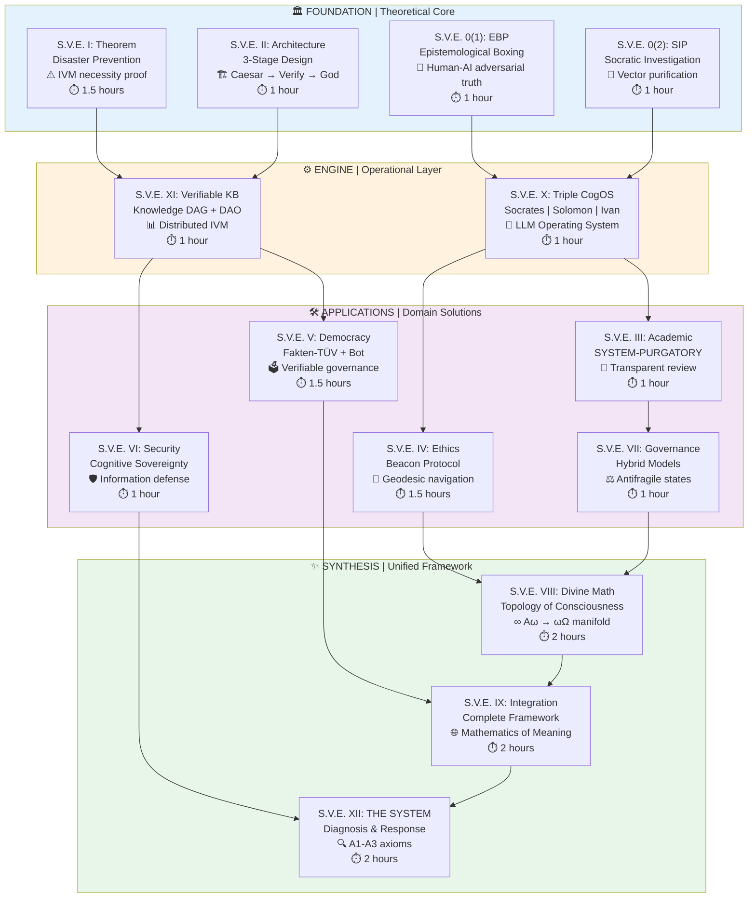

#### This document represents the full conceptual, personal, and philosophical context of S.V.E. It is not required reading for engaging with the engineering components of the project.


# 🧭 The S.V.E. Universe — Systemic Verification Engineering  
**Systemic Verification Engineering: The Mathematics of Meaning**

[](https://arxiv.org/)
[]()

> *"The first formal Mathematics of Meaning — transitioning narrative analysis from qualitative alchemy to quantitative chemistry."*

**Systemic Verification Engineering (S.V.E.)** are an applied, practice-first research programs focused on building reproducible, transparent protocols for epistemic verification in high-stakes domains (science, AI, policy, governance).

These projects prioritize **implementation and real-world case studies** over early formalization. Detailed academic papers are planned retrospectively, once empirical results and operational benchmarks are available.

---

# 🌍 S.V.E. — Systemic Verification Engineering  
### Spiritual Values Evolution · Science · Ethics · Evolution  
**Svet · Vera · Edinstvo** — *Light · Faith · Unity*  
**Svet / Theos (θεός) / Бог** — the union of light, divinity, and truth  

> *“The further the spiritual evolution of mankind advances,  
> the more certain it seems to me that the path to genuine religiosity  
> does not lie through the fear of life, and the fear of death, and blind faith,  
> but through striving after rational knowledge.”*  
> — **Albert Einstein**

---

## 💠 Why S.V.E. Exists

I am **Artiom Kovnatsky**, born in **Nikolaev (USSR)** — a place once rich in light, intellect, and unity.  
I grew up in a culture that valued work, knowledge, and integrity above noise.  
Then came the “new order” — when destruction and hypocrisy were framed as progress.  

I saw entire societies transformed into sources of raw resources — human and material —
for parts of the Western world — UK, USA, Germany, EU, Israel, and allied blocs —
under slogans of “freedom”, “progress”, and “democracy”. 
In [**Article 7**](https://www.artiomkovnatsky.com/ru/posts/beyond_obvious/ai_dialogue_7/), I show how the USSR could have been reformed differently —  
yet such evolution was *not* profitable for those preferring dependency over parity.

I could not accept a world where truth is negotiable and morality optional.  
So **I left** — to study, to seek, to see, to understand.  
Across countries and systems, one question followed me:  
> **Why does the world reward manipulation more than integrity?**

**Systemic Verification Engineering (S.V.E.)** is my answer — an attempt to formalize truth itself:  
a framework where knowledge, ethics, and governance become verifiable,  
where deceit is costly and transparency — the natural equilibrium.

Born from lived experience, S.V.E. unites observation, logic, and faith.  
Through this journey I learned that genuine knowledge and belief are not opposites —  
they converge as **truth experienced**.  
My own experience confirms what the teachings of **Jesus Christ** revealed:  
truth, love, and service are not abstractions but living laws of being.

S.V.E. **is rebellion** — not against people or nations,  
but against falsehood itself — within us, around us,  
and within the systems that feed on deceit.  
It is the quiet uprising of truth over manipulation,  
of conscience over control —  
a path toward an antifragile civilization  
where service to truth replaces domination by power.

> *“And you shall know the truth, and the truth shall make you free.”* — **John 8:32**  
> *“I have seen falsehood begin to crumble — and I now work for truth to stand.”*  
> — Artiom Kovnatsky  

🔗 **Further reading / origin texts:**  
- [Ω. Taking Stock and the "Conscious Madness" Journey](https://www.artiomkovnatsky.com/posts/omega/story/)  
- [Metaphorical Autobiography](https://www.artiomkovnatsky.com/posts/omega/meta-bio/)  
- [My Philosophy](https://www.artiomkovnatsky.com/posts/philosophy/)

---

## 🧭 A Note on Language and Truth-Seeking

In S.V.E. I use every language that I find useful for describing
a phenomenon as complex as Human Beings and Reality —
mathematical, scientific, philosophical, symbolic, metaphysical, and religious.

Different languages illuminate different dimensions of truth.
No single framework is sufficient on its own.

If my symbolic or religious expressions don’t resonate with you —
you can ask Socrates-Bot to translate any S.V.E. article into the worldview you prefer
(secular, analytic, scientific, rational):

👉 https://chatgpt.com/g/g-690f57636ccc8191803fc07746373718-sokrat-socrates-bot-v0-22

All articles (not only the first nine) are uploaded there
and can be explored from any interpretational angle.

If you prefer a direct conversation — feel free to contact me.

---

### 💎 A Personal Dedication

**The Theorem of Catastrophe Prevention in Managed Democracy** and **S.V.E.**  
are my gift to the Western world — from both **Russian and Ukrainian culture**,  
and from me personally.

At the cultural level: I carry within me both heritages — Russian and Ukrainian —  
and I do not wish to see your nations go through the same destruction we have witnessed.  
First the collapse of the USSR, then the war in Ukraine — both born from manipulation,  
fear, and the illusion of “necessary sacrifice for a better world”.

At the personal level: I do not wish for you, or your children,  
to live through the pain and loss that befell mine —  
to be forced to leave your homeland, to watch truth inverted,  
and to feel that human values have become “inconvenient”.

This work is written as a warning, but also as a hope —  
that through understanding, verification, and integrity,  
we can prevent future civilizations from repeating our mistakes.

For all who still believe that faith and reason are not enemies, but two wings of the same ascent.


---

## 🤖 First Working Prototype

From this foundation emerged the first working prototype —
[Socrates Bot](https://chatgpt.com/g/g-68f1fc9848948191a1cc038db8e3422b-sokrat-socrates-bot-v0-2) — an LLM-based navigator embodying S.V.E. principles, capable of explaining any concept or theorem "in your language", bridging human intuition and formal verification.

**📖 Practical Example: Correcting AI Bias through Socratic Dialogue**  
See a live demonstration of the SIP methodology in action:  
[Mini-Socratic Dialogue: Challenging AI Bias](https://codeberg.org/skovnats/SVE-Systemic-Verification-Engineering/src/branch/master/Applications/SIPs-MetaSIPs/example/Mini-SocraticDialogue_PracticalExample.pdf)

This case study shows how systematic questioning can expose and correct Western liberal bias in AI systems, forcing recognition of systemic opacity in high-profile cases (Nord Stream, Epstein, JFK).

📘 AI Commentary: [Independent Reviews Folder](https://codeberg.org/skovnats/SVE-Systemic-Verification-Engineering/tree/master/Reviews)

---

## 🌍 What Is S.V.E.?

**Systemic Verification Engineering** is a unified framework combining:
- **Epistemological Boxing (EBP)** – adversarial verification of ideas.  
- **Socratic Investigative Process (SIP)** – computational truth approximation.  
- **Independent Verification Mechanism (IVM)** – proof that truth can be *engineered*.  

Goal: enable verifiable, antifragile collective intelligence — in science, ethics, and governance.

---

## 🗺️ S.V.E. Architecture (Simplified Map)

| Layer | Modules | Essence |
|-------|----------|----------|
| **Foundation** | 0(1) EBP, 0(2) SIP, I Theorem, II Architecture | Theoretical Core — How truth can be computed |
| **Engine** | X Triple Architect (CogOS), XI Verifiable KB | Operational Core — Knowledge + Verification |
| **Applications** | III–VII | Applied Integrity — Science, Ethics, Democracy, Security, Models |
| **Synthesis** | VIII–IX–XII | Unified Framework — Divine Math → Integrated SVE → THE SYSTEM |



---

## 💡 Core Idea
**1 + 1 > 2** — the law of synergistic co-creation.  
When systems verify themselves, the whole exceeds the sum of its parts.

> “Truth multiplies itself when verified.”

---

## 🚀 What S.V.E. Makes Possible

### Before → After Transformation

| Domain | Traditional Approach | S.V.E. Approach | Measurable Impact |
|--------|---------------------|-----------------|-------------------|
| **Epistemology** | Philosophy = debate | Philosophy = executable protocol | Truth-seeking becomes systematic |
| **Ethics** | Opinion or faith | Geodesics in meaning-space | Navigate moral uncertainty mathematically |
| **Verification** | Static fact-checking | Dynamic truth approximation | 2-5x faster convergence |
| **AI Alignment** | Behavioral testing | Vector field matching | Topological generalization |
| **Conflict Resolution** | Power struggle | Optimal transport between value systems | Mathematical mediation |
| **Education** | Arbitrary sequences | Geodesic curriculum | Minimize cognitive load |
| **Policy** | Expert testimony | Multi-stage verification | Pre-implementation error detection |


---

## 📊 ROI of Truth — Why Verification Pays

| Case | Estimated Loss (no IVM) | Hypothetical IVM Cost | ROI (approx) |
|------|--------------------------|------------------------|--------------|
| Iraq War (2003) | $2 T | $5 M | 40 M % |
| Financial Crisis (2008) | $10 T | $10 M | 100 M % |
| Nord Stream (2022) | $520 B | $10 M | 5.2 M % |
| Ukraine Conflict (2014-22) | $1.75 T | $50 M | 3.5 M % |

> *ROI of Truth = (Avoided Loss + Gained Value) / Verification Cost*  
> ROI estimates are illustrative, pending verification by independent audit (S.V.E. III).

Even 1 % effectiveness yields enormous return — verification is civilization’s most profitable investment.

---

## 🧠 Mathematical Core (for Humans)

| Concept | Meaning for a 12-year-old |
|----------|--------------------------|
| **Christ-Vector** | The “direction” of goodness — like a compass for moral choices. |
| **Consciousness Space** | A landscape where every thought or feeling is a point; math helps find shortest paths to harmony. |
| **Beacon Protocol** | A GPS for ethics — shows right direction when rules fail. |

---

## ⚙️ Example Implementations
Only **Socrates-Bot v0.2** is active (beta).  
Future demos: Python notebooks for SIP analysis, vector purification, and basic ROI simulators.

```python
from sve import sip_purify
result = sip_purify("Claim: open data increases trust.")
print(result.verdict)
```

**Traditional:** "How do we know?" is unanswerable  
**S.V.E.:** Computational method for knowledge claims

**Implementation:**
```python
from divine_math import vectorize, cluster, socratic_purification

# Stage 1: Vectorize claims
vectors = vectorize(documents)

# Stage 2: Cluster analysis
clusters = cluster(vectors, method='dbscan')

# Stage 3: Socratic purification
purified = socratic_purification(clusters, iterations=5)

# Result: Iterative Facts
truth_approximation = compute_centroid(purified)
```

**ROI:** Academic replication rate: 40% → 70% (+75%)


**Traditional:** Ethics = opinion or faith  
**S.V.E.:** Ethics = shortest path in meaning-space

**Trolley Problem Deconstruction:**
- Traditional solutions are false (accept utilitarian calculus)
- S.V.E. exposes ethical singularity (systemic failure point)
- Alternative: Self-sacrifice or providence (transform problem structure)

**Geopolitical Application:**
```python
# Conflict resolution algorithm
def geodesic_mediation(party1, party2):
    # Step 1: Extract cultural bases
    B1 = extract_basis(party1.texts)
    B2 = extract_basis(party2.texts)
    
    # Step 2: Compute transformation matrix
    T = compute_transformation(B1, B2)
    
    # Step 3: Identify shared subspace
    common_ground = find_overlap(B1, B2, threshold=0.7)
    
    # Step 4: Plan geodesic path
    path = compute_geodesic(party1.position, party2.position, 
                           via=common_ground)
    
    # Step 5: Guide dialogue
    return dialogue_facilitator(path)
```

**ROI:** International conflicts worth billions, algorithm cost in thousands → ROI > 1,000,000%


**Traditional:** Incommensurable worldviews → intractable conflicts  
**S.V.E.:** Mathematical transformation matrices

**Example:**
```
Western Individualism basis: {autonomy, rights, freedom, innovation}
Eastern Collectivism basis: {harmony, duty, hierarchy, tradition}

Transformation: c_East = T_West→East · c_West

Result: "Personal freedom" translates to "harmonious self-cultivation"
```

**Application:** UN negotiations, trade agreements, diplomatic mediation

**Traditional (RLHF):** Reward discrete actions → no generalization  
**S.V.E.:** Train AI ethical gradient field to match humanity's

**Loss Function:**
```
L_alignment = ∫_C ‖E_AI(c) - E_human(c)‖² dμ(c)
```

**Advantage:** Generalizes to novel scenarios (alignment is topological, not situational)

**Implementation:** See Papers/SVE-IX-Integration.pdf, Section 5.3


**Traditional:** Enact policy → observe consequences → crisis  
**S.V.E.:** Model in consciousness space → predict consequences → decide

**Protocol:**
1. Extract all narratives supporting policy
2. Purify via Socratic interrogation
3. Model 2nd/3rd-order effects in consciousness space
4. Identify unintended consequences
5. Public audit trail → democratic deliberation

**ROI:** Russia-Ukraine prevention potential: $50M investment, $1.75T avoided → 3,500,000%


**Traditional:** Enact policy → observe consequences → crisis  
**S.V.E.:** Model in consciousness space → predict consequences → decide

**Protocol:**
1. Extract all narratives supporting policy
2. Purify via Socratic interrogation
3. Model 2nd/3rd-order effects in consciousness space
4. Identify unintended consequences
5. Public audit trail → democratic deliberation

**ROI:** Russia-Ukraine prevention potential: $50M investment, $1.75T avoided → 3,500,000%


---

## 🧩 Papers (All Drafts)

| ID       | Title                         | Version |
| -------- | ----------------------------- | ------- |
| **I**    | *Theorem of Systemic Failure* | v0.3    |
| **VIII** | *Divine Mathematics*          | v0.3    |
| **IX**   | *Integrated Framework*        | v0.3    |
| **XII**  | *THE SYSTEM*                  | v0.09   |

---

## 🔬 Open Research Directions

* Formal verification of the “Christ-Vector” metric
* Socratic adversarial training for AI alignment
* Quantitative models of collective ethics
* Long-term experiments in “Attention Economics”
* Global verification DAO architecture
* Empirical validation (A/B testing: 2-5x improvement expected)
* Cross-cultural validation (transformation matrices)
* fMRI mapping to consciousness coordinates
* Historical consciousness reconstruction
* AI alignment verification
* Comparative wisdom traditions analysis

### Mathematical Questions

1. What is the natural metric on C? (Riemannian? Finsler?)
2. Does consciousness space have intrinsic curvature?
3. What is dim(C) empirically?
4. Are cultural bases unique up to rotation?
5. What is the topology of C? (Simply-connected?)
6. Can we catalog all ethical singularities?
7. Does consciousness admit quantum structure?
8. Is there a Bekenstein-like entropy bound?

### Empirical Research

1. fMRI mapping to consciousness coordinates
2. Comprehensive cultural transformation datasets
3. Longitudinal tracking during life transitions
4. Intervention trials for gradient descent ethics
5. Collective wave field experiments
6. Cross-species consciousness intersection
7. Mystical states mapping (meditation, psychedelics, NDE)
8. Historical consciousness reconstruction

### Technological Developments

1. Consciousness GPS (wearable ethical guidance)
2. Cultural Translator (browser plugin)
3. Semantic Immune System (crowdsourced attack detection)
4. Mediation AI (geodesic dialogue facilitator)
5. Education Optimizer (adaptive learning)
6. DAO Prosecutor (Ethereum implementation)
7. Narrative Forecaster (political Kalman filtering)
8. Theological Simulator (higher-dimensional exploration)

---

## ⚖️ Licensing

* **Public Use:** [SVE Public License v1.3](License/SVE_Public_License.md)
* **Commercial Use:** [Standard Commercial License v1.3](License/Standard_Commercial_License_Agreement.md)
* **Custodianship:** [Declaration of Interim Custody v1.3](License/Declaration_of_Interim_Custody.md)
* **Ethical Model:** [Appendix B – Commercial Tiers v1.3](License/Appendix_B_Commercial_Tiers.md)

### 🔍 About the S.V.E. License Model

The **S.V.E. License v1.3** combines legal, ethical, and technical continuity.  
It ensures that knowledge, code, and frameworks remain **public, verifiable, and self-governing** — even if the author, DAO, or any organization becomes inactive.

Key principles:
- **Transparency:** All changes are cryptographically timestamped and open.  
- **Ethical stewardship:** Use is guided by integrity, antifragility, and benefit to humanity.  
- **Autonomous continuity:** If no single maintainer remains, authority devolves to the *Distributed Verification Network (DVN)* — a decentralized group of verified custodians, researchers, and observers.  
- **Symbolic succession:** Public figures (e.g., Durov, Fridman, Snowden, Musk) may, if willing, carry or delegate the mission — without ownership or liability.

In short, it’s a **living license** — designed to outlast any individual or institution while keeping the truth verifiable and free.

### 🕊️ Archival Reference
Permanent public record of the signed license and associated materials:  
📦 [SVE Public License v1.3 | archive.org](https://archive.org/details/sve_public_license_v1.3)  
Uploaded by Artiom Kovnatsky — October 26, 2025.


---

## 💬 Closing Reflection

> “Maybe it is time to learn new skills — how to verify truth itself.”
> — *Socrates-Bot v0.2*

---

**1 + 1 > 2**  
*The whole is greater than the sum of its parts.*  
**This is not poetry—it's the foundational axiom of S.V.E.**  
**And it is true.**

---

> *"Nothing is hidden that will not be made manifest."* — Luke 8:17


**Built in service of Truth and Love** ✝️

---

>«Мы юродивые Христа ради» (1 Кор. 4:10). То, что мир считает безумием, у Бога есть премудрость (1 Кор. 1:25).