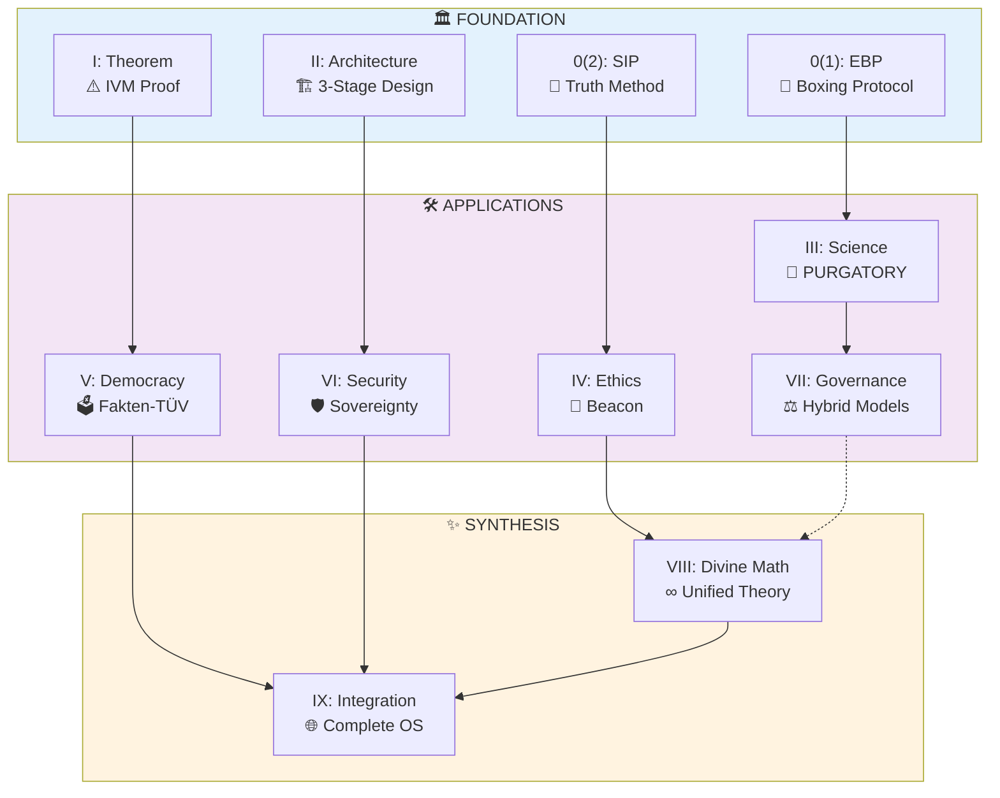

# S.V.E. Universe
**Systemic Verification Engineering: Making Truth Operational**

[](License/SVE_Public_License_v1.3.md)
[](https://arxiv.org/)

> *"Truth amplifies itself; falsehood decays."*

---

## 🎯 The Core Problem

**Civilizations collapse because collective intelligence lacks verification.**

The **Disaster Prevention Theorem** proves: *Without Independent Verification Mechanisms (IVM), even rational individuals produce catastrophic collective failures.*

**S.V.E. is the first operational solution.**

---

## 🗺️ Visual Navigation



**📖 Reading Paths:**
- **Minimal** (4h): SIP → Theorem → Architecture → Democracy OS
- **Complete** (25h): All papers 0(1) → IX
- **Applied** (3h): Architecture → Democracy OS → Tools

*See [NAVIGATION.md](Community/NAVIGATION.md) for detailed guide.*

---

## 💡 What S.V.E. Makes Possible

### Before → After

| **Old World** | **S.V.E. World** |
|---------------|------------------|
| Philosophy = abstract | Philosophy = executable |
| Truth = opinion | Truth = verifiable |
| Institutions decay | Institutions improve from attacks |
| Peer review = opaque | Peer review = transparent boxing |
| Ethics = rules | Ethics = geodesic navigation |
| Fact-checking = partisan | Fact-checking = architectural |


*Full capability matrix: [BREAKTHROUGH_INNOVATIONS.md](BREAKTHROUGH_INNOVATIONS.md)*

**Deep dives:**
- [Divine Mathematics Integration Guide](DIVINE_MATH_INTEGRATION.md) — Technical documentation of SVE VIII additions
- [Integration Visual Comparison](INTEGRATION_VISUAL.md) — Before/after matrices and impact analysis

---

## ⚡ Core Technologies

| Tech | Innovation | Use Case |
|------|-----------|----------|
| **EBP** | Human-AI adversarial truth synthesis | Philosophy → Protocol |
| **SIP** | Iterative vector purification | Claims → Verified facts |
| **Beacon** | Geodesic ethics | Moral dilemmas → Navigation |
| **3-Stage** | Separate facts from values | Institutions → Integrity |
| **Meta-SIP** | Multi-agent verification | Geopolitics → Clarity |

---

## 🌟 Breakthrough Capabilities

### 1. **Operationalized Epistemology**
First system to turn "How do we know?" into **executable protocol**.

### 2. **Mathematics of Meaning**
Reality as Riemannian manifold ($\mathcal{A}\pi \to \pi\Omega$) — unifies theology, ethics, economics.

### 3. **Antifragile Institutions**
Systems that **improve from attacks** (not just resist them).

### 4. **Cross-Species Ethics**
Map human-animal consciousness correspondence via geometric topology.

### 5. **Civilizational Health Metric**
Quantify societal resilience: $\rho(t) = f(\text{Truth, Love, Structure, Will})$

*Full capability matrix: [BREAKTHROUGH_INNOVATIONS.md](Community/BREAKTHROUGH_INNOVATIONS.md)*

---

## 🚀 Quick Start

### 👤 **I want to USE it**
```
1. Try Socrates Bot (15 min) → Experience S.V.E.
2. Read SVE-II Architecture (30 min) → Understand pattern
3. Read SVE-V Democracy OS (45 min) → See implementation
4. Pilot in your context → Applications/
```

### 🔬 **I want to RESEARCH it**
```
1. Read SVE-0-2-SIP (1h) → Method
2. Read SVE-I-Theorem (1.5h) → Proof
3. Read SVE-II-Architecture (1h) → Design
4. Choose domain → SVE-III to VII (1-1.5h each)
5. Deep dive → SVE-VIII + IX (3-4h)
```

### 💼 **I want to ADOPT it** (Institutions)
```
1. Review SVE-V Democracy OS
2. Contact artiomkovnatsky@pm.me
3. Choose pilot:
   • Academic → SYSTEM-PURGATORY
   • Media → Fakten-TÜV
   • Government → Cognitive Sovereignty
```

*Detailed guide: [QUICKSTART.md](Community/QUICKSTART.md)*

---

## 📚 Citation

```bibtex
@misc{kovnatsky2024sve,
  author = {Kovnatsky, Artiom},
  title = {Systemic Verification Engineering (S.V.E.): 
           A Unified Framework for Institutional Integrity},
  year = {2024},
  url = {https://github.com/skovnats/SVE-Systemic-Verification-Engineering},
  note = {Licensed under SVE Public License v1.3}
}
```

---

## 🛡️ License

**[SVE Public License v1.3](License/SVE_Public_License_v1.3.md)** (CC BY-NC-SA 4.0 + SVE Addendum)

| Use Case | Status | Notes |
|----------|--------|-------|
| Academic, non-profit, journalism | ✅ **Free** | Attribution + ShareAlike |
| Commercial / for-profit | ⚠️ **Paid** | [Appendix B](License/Appendix_B_Commercial_Tiers.md) |
| Intelligence / propaganda | ❌ **Prohibited** | Unless radical transparency |

**Unique:** *Logical Inevitability of Disclosure* — concealed use becomes structurally unsustainable ([Appendix A](License/Appendix_A_Logical_Inevitability.md))

**Contact:** artiomkovnatsky@pm.me

---

## 🗓️ Roadmap

```
2024-2025: Foundation
  [x] 9 papers complete
  [x] SVE License v1.3
  [x] Socrates Bot MVP
  [ ] arXiv publication
  [ ] Peer review

2025-2026: Validation
  [ ] Wikipedia audit (5 articles)
  [ ] SYSTEM-PURGATORY (1-2 journals)
  [ ] Commercial Tier 1/2 users
  [ ] 33-Month Review

2026-2027: Institutionalization
  [ ] Fakten-TÜV pilot
  [ ] SVE DAO formation
  [ ] Academic textbook
```

---

## 🤝 Contributing

**We need:**
- 🧪 Researchers (empirical validation)
- 💻 Developers (tools, APIs)
- 🌐 Translators (RU, DE, ES, ZH)
- 🏛️ Institutions (pilot programs)

👉 [CONTRIBUTING.md](Community/CONTRIBUTING.md) | [FAQ](Community/FAQ.md) | [Governance](Community/GOVERNANCE.md)

---

## 📬 Connect

- **Author:** Artiom Kovnatsky
- **Email:** artiomkovnatsky@pm.me
- **Website:** [sve-framework.org](https://sve-framework.org) *(coming soon)*
- **Commercial:** See [License Appendix B](License/Appendix_B_Commercial_Tiers.md)

---

## 🙏 Acknowledgments

**Foundations:** Socrates, Popper, Taleb, Schmidel  
<!-- **Co-Custodians:** Andrey Liubanin & [Exodus Project](https://exodus.tilda.ws/exodus20breef) -->

---

## 📊 Repository

```
SVE-Systemic-Verification-Engineering/
├── Papers/              # 9 core papers (0(1) → IX)
├── License/             # SVE PL v1.3 + Appendices
├── Tools/               # Socrates Bot, auditors
├── Applications/        # PURGATORY, Fakten-TÜV, Meta-SIP
└── Community/           # Contributing, FAQ, governance
```

*Full details: [Community/REPOSITORY_STRUCTURE.md](Community/REPOSITORY_STRUCTURE.md)*

---

**Built in service of Truth and Love** ✝️

> *"Nothing is hidden that will not be made manifest."* — Luke 8:17