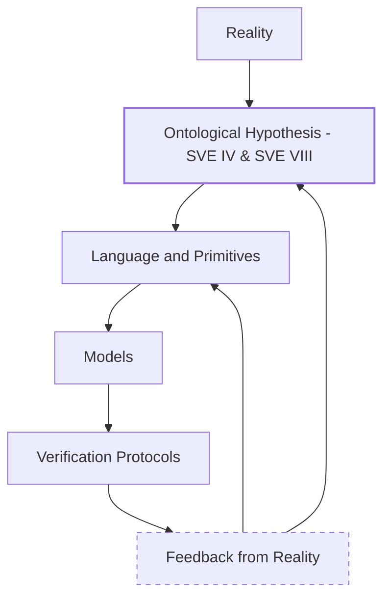

# Systemic Verification Engineering (S.V.E.)

Systemic Verification Engineering (S.V.E.) is a **practice-first research** and **engineering program** for building **reproducible**, **transparent**, and **adversarial protocols** for epistemic verification in high-stakes domains (science, AI, governance, policy).

The ethical core of the project is explicitly grounded in key principles articulated in the teachings of **Jesus Christ** (e.g. Love of neighbor, the primacy of life, non-violence, Honesty, and the principle of treating others as one wishes to be treated). This core does not require agreement, belief, or adherence: it functions as a declared set of initial axioms, analogous to axioms in mathematics or constraints in engineering.

Crucially, **everything in S.V.E. is subject to doubt, challenge, and verification**, including the project’s own ethical core. No premise is exempt from scrutiny; authority is **never** a substitute for evidence. Ethical axioms are treated as hypotheses that must justify themselves through measurable outcomes, operational KPIs, and real-world consequences.

> *S.V.E.: Онтологический эксперимент с инженерной обратной связью Жизни|реальности*\
> *S.V.E.: Ontologisches Experiment mit technischem Feedback aus der Realität*\
> *S.V.E.: Ontological experiment with engineering feedback from reality*


> **Failure of models, protocols, or deployments is treated as first-class evidence and feeds back into revision of assumptions, language, and ethics.**


---

## Core Principles
- Verification over persuasion
- Transparency over authority
- Practice before formalization
- **Reproducibility** as a first-class constraint
- **Human dignity & Love** as explicit design constraint

> *[S.V.E.-IV](Papers/SVE-4.pdf) and [S.V.E.-VIII](Papers/SVE-8.pdf) ([clarification](Papers/SVE-8.md)) define the current working [ontological](https://en.wikipedia.org/wiki/Ontology) hypothesis; other S.V.E. protocols are explicitly used to test and revise it.*


```mermaid
flowchart TD
    R[Reality]
    O[Ontological Hypothesis - SVE IV & SVE VIII]
    L[Language and Primitives]
    M[Models]
    V[Verification Protocols]
    F[Feedback from Reality]

    R --> O --> L --> M --> V --> F
    F --> O
    F --> L

    style O stroke-width:2px
    style F stroke-dasharray: 5 5

```

> *S.V.E. is not about proposing a new truth.*\
> *It is about **building systems that can survive contact with reality**.*

---

## Scope & Research Questions

S.V.E. investigates and develops **decentralized, verifiable, and scalable protocols** for epistemic integrity and collective decision-making.
Core application domains include (but are not limited to):

* verifiable democratic processes and civic governance,
* large-scale fact-checking and narrative verification systems,
* verifiable knowledge platforms (e.g. Wikipedia-like systems with auditability),
* next-generation StackOverflow-style systems with integrity guarantees,
* tooling for cognitive hygiene, epistemic resilience, and protection against large-scale manipulation.
* ...

Beyond specific products, the project explores how **prosperous and stable societies** can be built using **explicit, measurable ethical constraints**, translated into operational KPIs for real systems. This includes research into sustainable economic models, incentive alignment, and long-term societal resilience.

At its core, S.V.E. is grounded in a **small set of ethical axioms**, most notably key principles articulated in the teachings of Jesus Christ (e.g. love of neighbor, the primacy of life and human dignity, and the aim that people may “have life, and have it abundantly”).
These principles are **not treated as dogma**, but as **high-level ethical constraints**, deliberately grounded through:

* operational metrics,
* system-level KPIs,
* mathematical modeling,
* and practical engineering approaches.
* ...

All theological and ethical assumptions are made explicit, testable at the system level, and subject to verification through outcomes, not authority.

---

## Repository Structure

### 🔧 Engineering & Practice
- **[Applications/](Applications/)** — practical systems and pilots (e.g. PFP / Fakten-TÜV)
- **[Applications/FieldNotes/](Applications/_FieldNotes)** — What we did → What actually happened → What had to be changed...
> Field Notes are the primary unit of evidence in S.V.E.\
> Papers, when written, are retrospective compressions of Field Notes.
- **[Applications/Ontology-VKB](Applications/_Ontology-VKB)** — Working ontological hypotheses, grounded through practice:\
  What we did → What actually happened → What had to be changed...
```
Field Notes → VKB → Ontology-VKB → update langauge
```

> **In a nutshell**
> - VKB - is a journal of testable assertions.
> - Ontology-VKB - is a journal of testable assumptions about how the world works.\
> *VKB — Verifiable Knowledge Base*

- **[Reviews/](Reviews/)** — AI, meta-AI, and Stanford agent-based reviews of S.V.E. papers
- **[Socrates Bot](https://chatgpt.com/g/g-690f57636ccc8191803fc07746373718-sokrat-socrates-bot-v0-22)** — all articles are uploaded there
and can be explored from any interpretational angle; it serves alse as thought-academia. 
- **[MATH-NOTARY/](MATH-NOTARY/)** — mathematical notary & statistical verification layer (personal failsafe)

### 📄 Papers & Protocols
- **[Papers/](Papers/)** — S.V.E. working papers and reference documents

---

## Status
S.V.E. is an active research-engineering program.
Academic publications are planned retrospectively, once sufficient empirical evidence and deployed systems exist.

---

## MVP / Quickstart — Fakten-TÜV v0 (1 evening)

**TODO**

1. Pick 10 recent public factual claims (non-political).
2. Create a VKB entry for each claim (source, date, exact wording).
3. Collect primary sources (laws, datasets, transcripts); log conflicts.
4. Produce a short audit verdict: True / False / Misleading / Unverifiable.
5. Publish each audit as a single Markdown page with citations.
6. Write a Field Note for each audit:
   What we did → What actually happened → What had to be changed.
7. Track 5 metrics weekly: TCR, ED, RR, TTA, REV.
8. If an audit is challenged, update logs and revise the process — not the claim.


---

## ⚖️ Licensing

* **Public Use:** [SVE Public License v1.3](License/SVE_Public_License.md)
* **Commercial Use:** [Standard Commercial License v1.3](License/Standard_Commercial_License_Agreement.md)
* **Custodianship:** [Declaration of Interim Custody v1.3](License/Declaration_of_Interim_Custody.md)
* **Ethical Model:** [Appendix B – Commercial Tiers v1.3](License/Appendix_B_Commercial_Tiers.md)

--- 

## 🌍 Community & Public Verification Initiatives

The **[Community/](Community/)** directory documents public, civic, and experimental initiatives where S.V.E. protocols are applied outside laboratory or academic settings.
These projects serve as **field tests** for epistemic verification, narrative accountability, and asymmetric responsibility in real-world environments.

This section contains **real-world applications and stress tests** of the S.V.E. / SIP protocols in high-stakes, adversarial, and public environments.

These materials are not advocacy, **not political statements**, and **not claims of truth**. They document how verification protocols behave under pressure, asymmetric incentives, and narrative conflict.

These initiatives are documented as field experiments; their inclusion does not imply endorsement of any political position, but reflects a focus on **Human rights protection**. 


> *All datasets, links, analyses, prompts/context data and AI/meta-AI reviews are published for independent replication and critique and can be replicated in practice by anyone with access to a standard PC and a publicly available large language model (e.g., ChatGPT), with direct URLs to each LLM analysis provided.*


### Open Letters & Academic Integrity

* **[Community/OpenLetters/](Community/OpenLetters/)**
  Open letters addressed to academic and public institutions, advocating for the restoration of honesty, methodological rigor, and the role of academia as a moral and epistemic lighthouse.
  The series *“44 Days Later (33 + 3 + 8)”* documents a structured appeal for systemic reform and the re-legitimization of truth-seeking figures (e.g. Socrates, Perelman) within modern institutions.\
  *Goal:* initiate verifiable, documented dialogue — not persuasion.

### Narrative Accountability & Asymmetric Power

* **[Community/LightBlackMirror_27112025/](Community/LightBlackMirror_27112025/)**
  An analytical project examining asymmetries of responsibility, influence, and “skin in the game” among political and institutional actors, evaluated through the S.V.E. framework and related epistemic lenses.\
  *Goal:* expose structural patterns, not evaluate individuals.

### David vs. Goliath — Adversarial Intellectual Challenges

* **[Community/19092025_David_vs_GOLIATH_SerhiiSternenko/](Community/19092025_David_vs_GOLIATH_SerhiiSternenko/)**
* **[Community/20092025_David_vs_GOLIATH_JulianRoepcke/](Community/20092025_David_vs_GOLIATH_JulianRoepcke/)**\
  A series of public intellectual challenges using S.V.E. SIP protocols to test narratives and claims that fail verification thresholds.
  These cases function as adversarial stress-tests of public discourse under asymmetric visibility and power.\
  *Goal:* demonstrate asymmetry between narrative power and verification robustness.

### “444 Days” Protocol — Institutional Reality Check

* **[Community/19112025_Berlin_Bundestag_SoloPerformance/](Community/19112025_Berlin_Bundestag_SoloPerformance/)**\
  A long-running verification protocol applied to official statements and commitments by the German Ministry of Foreign Affairs and related institutions.
  Initiated after formal complaint closure, the project examines whether public words withstand S.V.E. verification when confronted with observable reality and human rights outcomes.\
  *Goal:* time-extended falsifiability of institutional claims.


---

### How to Read These Materials

These initiatives are **not required** to understand or use the engineering components of S.V.E.
They are provided as **documented applications**, illustrating how verification protocols behave under public pressure, political asymmetry, and real human consequences.

---


## Additional Context

- **[README.Opa.md](README.Opa.md)** — complete project context, including personal motivation, philosophical and ethical foundations, theoretical extensions, and open questions.

---